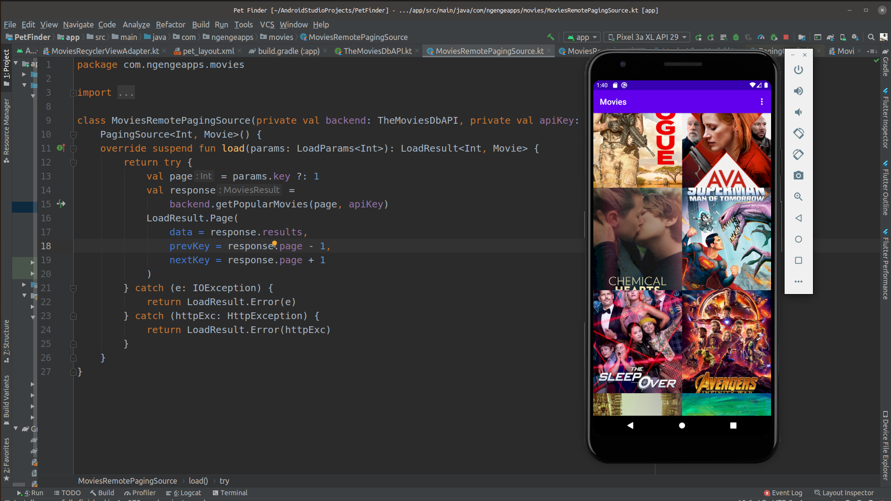

## Movies Paging 3
The project is a hands on practice using [Paging 3](https://developer.android.com/topic/libraries/architecture/paging/v3-overview) library on Android and as well follows the recommended app architecture for Android
Here is a screenshot

